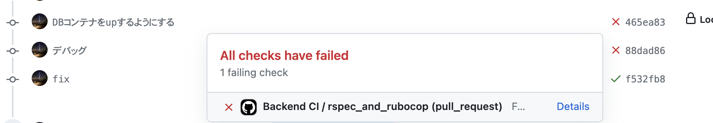

# バックエンドのCIについて
## 概要
- Github Actionsを用いて行います。
  - RubocopとRspecを実行するように設定しています。

## 詳細
- `.github/workflows/backend_test.yml`にCIの設定を記載しています。
- PR上でpushされるたびにCIが走ります。
- CIが落ちた時は、添付の画像のように赤色の❌マークが付きます。
  - CIが落ちた時は、「details」からどの部分でCIが落ちたのか？を確認し、修正しましょう。

